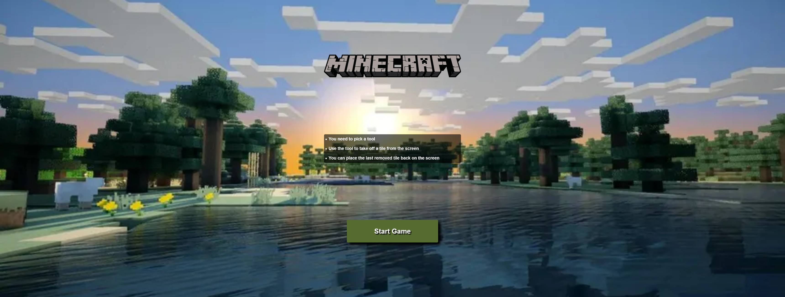
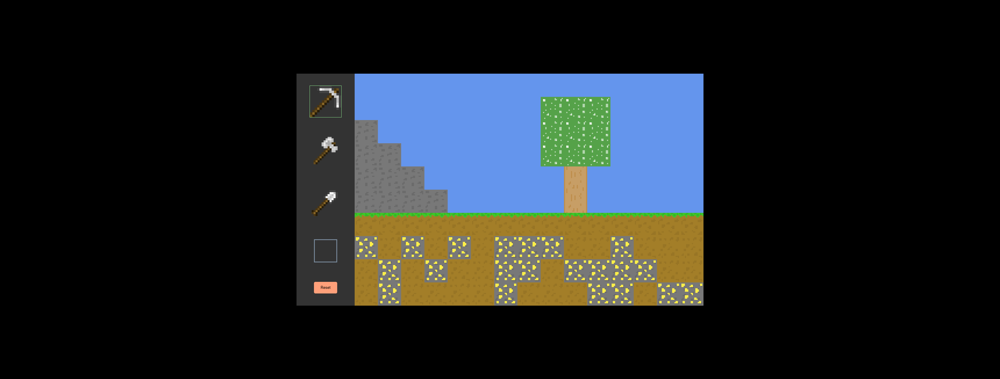

# 2D-MineCraft

##This is a MineCraft Game in 2 dimensions

- link:https://minecraft2d-appleseeds.netlify.app/

## There are three rules in this game
- You need to pick a tool in order to interact with the elements of the world
- Use the tool to take off a tile from the screen
- You can place the last removed tile back on the screen

## This project was implemented using:
- HTML
- CSS 
- Javascript

## Project Preview Images: 

